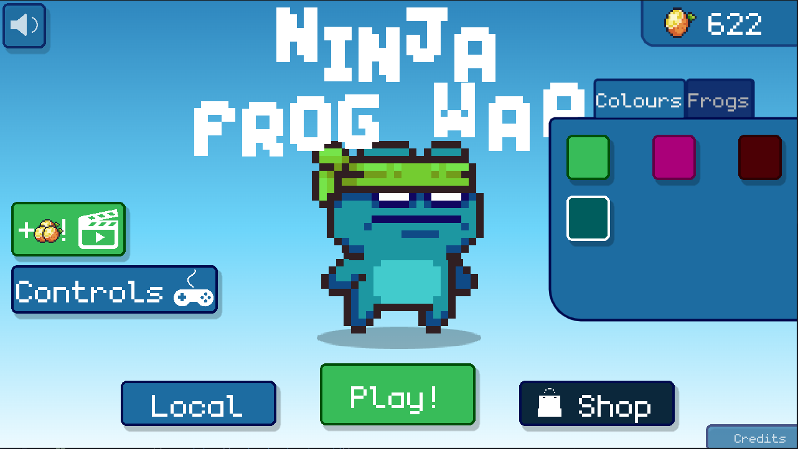

# Ninja Frog War 🐸🔥

Ninja Frog War is a multiplayer arena fighting 2D game based on [Fish Game](https://github.com/heroiclabs/fishgame-godot) repo, featuring different assets, expanded features, and slightly modified gameplay. Take control of a ninja frog and engage in epic battles!

## New Features

- 🐸 Fancy looking skin preview.
- 🛒 Unlock new characters and skins in the Shop.
- 🏹 New weapon Bow.
- 🗺️ Different playgrounds.
- 🏆 Win congratulations.
- ❤️ Health points

## Demo

Experience the game firsthand by checking it out on [my itch.io](https://ash4rk.itch.io/).

## Installation
At this point you can use the original [method](https://github.com/heroiclabs/fishgame-godot#playing-the-game-from-source).

## License
Because the project is based on [Fish Game](https://github.com/heroiclabs/fishgame-godot) it is licensed under [Apache 2.0 License](LICENSE.txt).

Most assets and resources are CC or MIT licensed.

Check out [CREDITS.md](https://github.com/ash4rk/wars-wars-wars/blob/main/CREDITS.md) for clarity and links to asset sources.
